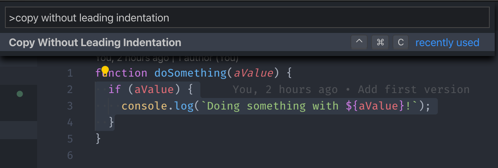
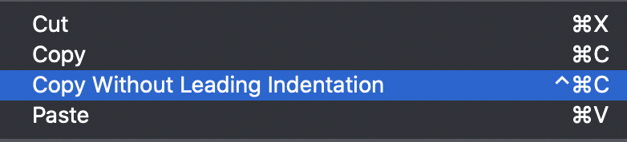

# Snippet Copy

Ever wanted to copy part of a source file as a snippet and paste it somewhere else, like in Slack or in a GitHub comment?
Previously, you either got a bunch of unnecessary indentation that made the snippet ugly to read or you had to manually un-tab the snippet, copy, and then reset the indentation.

With **Snippet Copy** you can automatically get a snippet added to your clipboard with all the unnecessary indentation already removed!

## Features

You can use the extension via a bunch of different ways:

- Via the Command Palette and the pre-configured keyboard shortcut

	

- Via the Context Menu on selected text in the editor

	
